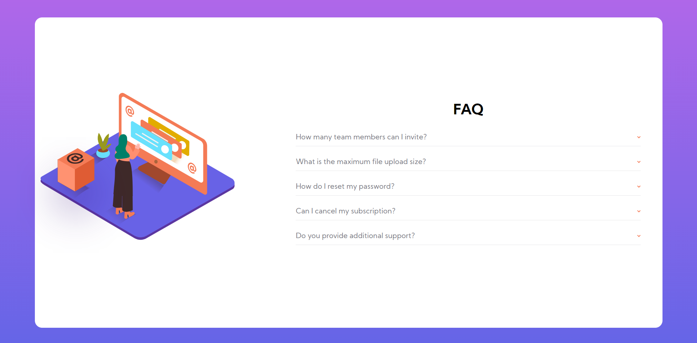

# Frontend Mentor - FAQ accordion card solution

This is a solution to the [FAQ accordion card challenge on Frontend Mentor](https://www.frontendmentor.io/challenges/faq-accordion-card-XlyjD0Oam).

## Table of contents

- [Overview](#overview)
  - [The challenge](#the-challenge)
  - [Screenshot](#screenshot)
  - [Links](#links)
- [My process](#my-process)
  - [Built with](#built-with)
  - [What I learned](#what-i-learned)
  - [Continued development](#continued-development)
- [Author](#author)

**Note: Delete this note and update the table of contents based on what sections you keep.**

## Overview

FAQ accordion card, where further content displays when clicking on each question. Built with HTML, CSS and JS

### The challenge

Users should be able to:

- View the optimal layout for the component depending on their device's screen size
- See hover states for all interactive elements on the page
- Hide/Show the answer to a question when the question is clicked

### Screenshot

### Links

- Solution URL: [Github](https://github.com/rrgmon/frontendmentor-challenge-newbie-4)
- Live Site URL: [Live Site](https://rrgmon.dev/frontendmentor-challenge-newbie-4/)

## My process

Started with mobile first design, set everything right and then moved to the desktop version of the site. And then added the main functionality of the page.

### Built with

- Semantic HTML5 markup
- Javascript
- CSS custom properties
- Flexbox
- Mobile-first workflow

### What I learned

I learnt how important setting the right margins and paddings are.

### Continued development

Still trying to figure out the widths and heights of each component.

## Author

- Website - [Rohit Regimon](https://rrgmon.dev)
- Frontend Mentor - [@rrgmon](https://www.frontendmentor.io/profile/rrgmon)
- Twitter - [@rohitregimon](https://www.twitter.com/rohitregimon)
